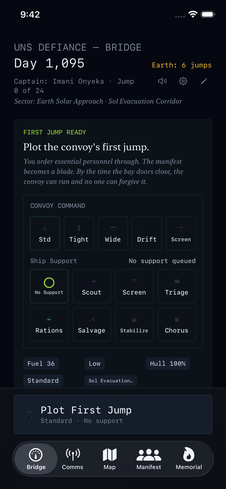
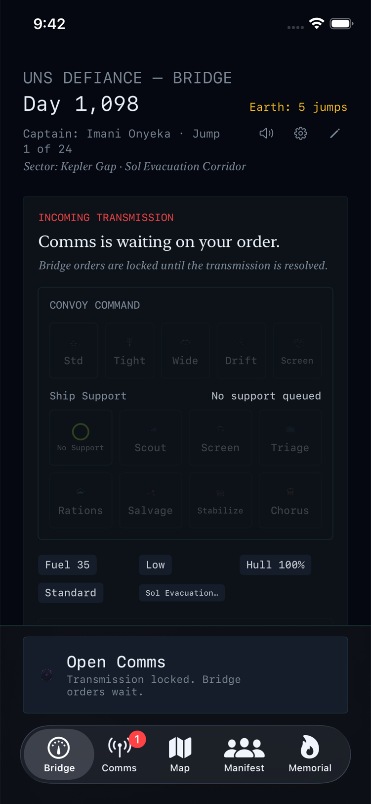
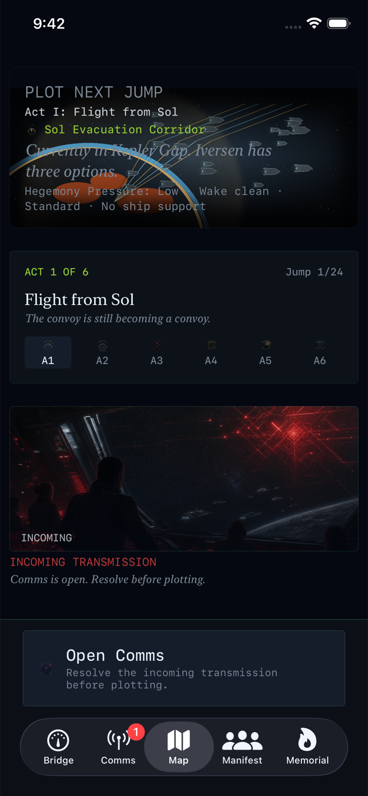
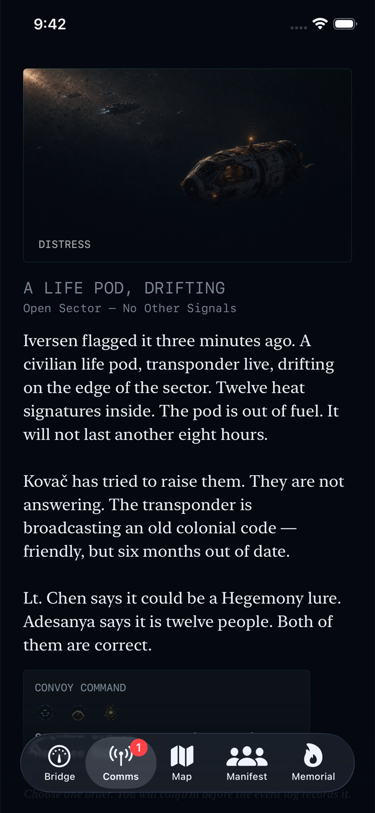

# The Long Retreat

**Lead the last civilian convoy through 24 jumps. Every order is final.**

[Visit the official site](https://rzkowski.com/projects/the-long-retreat/)

## How It Works

You command the UNS Defiance from the Bridge. Pick routes, assign ship support, and answer distress calls while fuel drops and pursuit pressure rises. The run log is append-only: choices stay made, losses stay recorded, and the Memorial keeps the names of the people command could not save.

## Screenshots

| Bridge command | Route pressure | Distress call | Run record |
|---|---|---|---|
|  |  |  |  |

- 144 hand-written encounters across a 24-jump campaign.
- No ads, no in-app purchases, no account sign-in.
- Iron Mode records choices and losses in an append-only event log.
- Every jump forces a choice. Fuel runs low. People die. The log remembers.

## At a Glance

- iPhone narrative survival command game
- Launch candidate
- Official site: <https://rzkowski.com/projects/the-long-retreat/>
- Source code is private; this repo is a public promo page only

## Source Code Boundary

This public repository is only the promo page. The app source code, project files, private config, internal docs, local artifacts, and release workflows are not published here.
